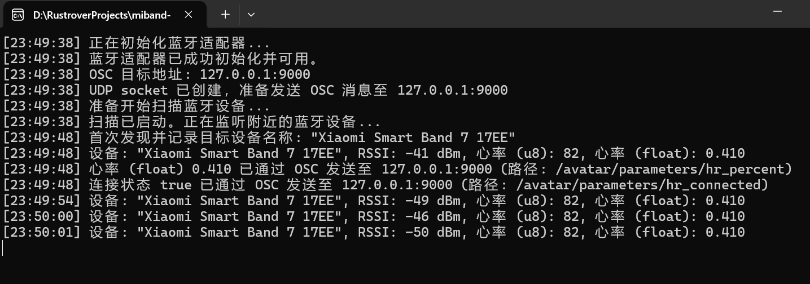

# MiBand Heart Rate Demo

A Demo of reading "Shear heart rate data" of Xiaomi Smart Band 6. Enable the option in official App is required.

接收小米手环6/7 “运动心率广播” Demo，测试前需要在小米运动健康App中开启手环的该选项。

欢迎二次开发。

### AlisaCat: 
1.增加 记录首次发现的设备名称 实现只关注此设备功能

2.增加 OSC相关功能 可以把心率数据 以float格式传递至VRChat中，适配对应的Booth心率显示预制件为：https://booth.pm/zh-cn/items/6224828

留言：将就用一下！现在问题是处理大量的广播包，会占用一定的CPU，但是可以修改目标OSC地址，通过其他设备来监听心率，发回主机的OSC地址上！

## Supported Platform

I use `bluest` crate. I copy its words below.

> Bluest is a cross-platform Bluetooth Low Energy (BLE) library for Rust. It currently supports Windows (version 10 and later), MacOS/iOS, and Linux. Android support is planned.

So it supported:

- Windows 10
- MacOS/iOS
- Linux

## Supported MiBands

MiBand4, 5, 6, 7 小米手环4、5、6、7

Tested on MiBand6/NFC.

Tested on MiBand7/NFC.

## Screenshot

